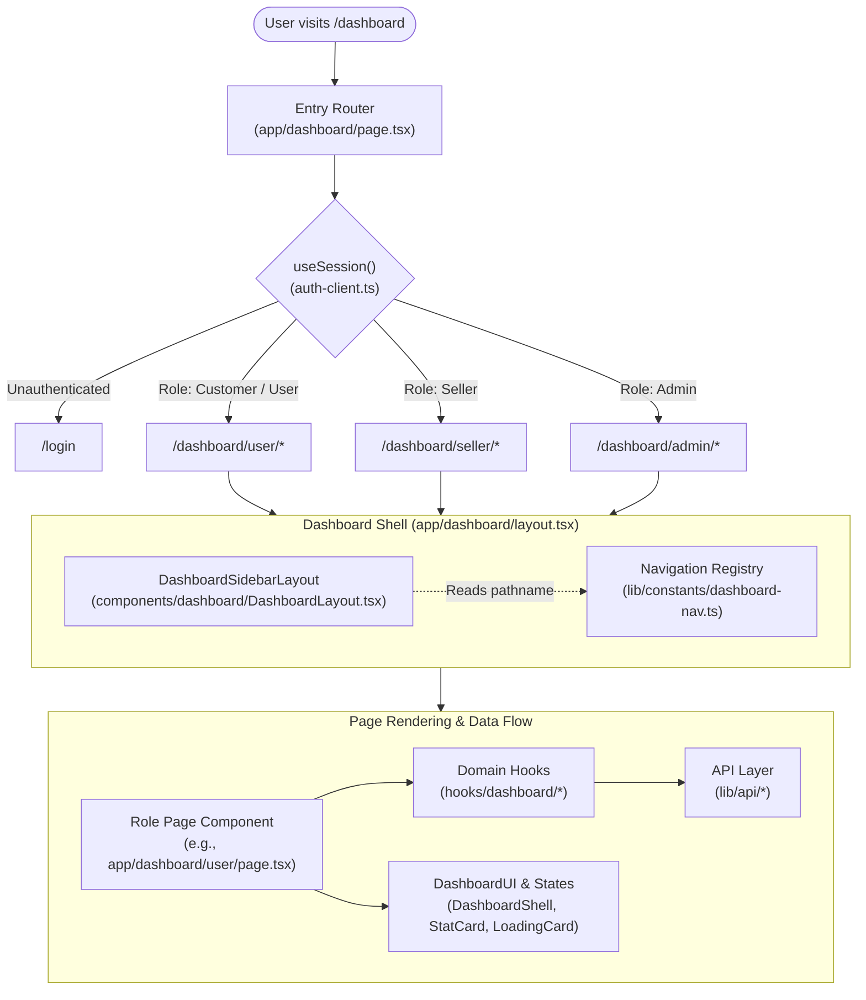
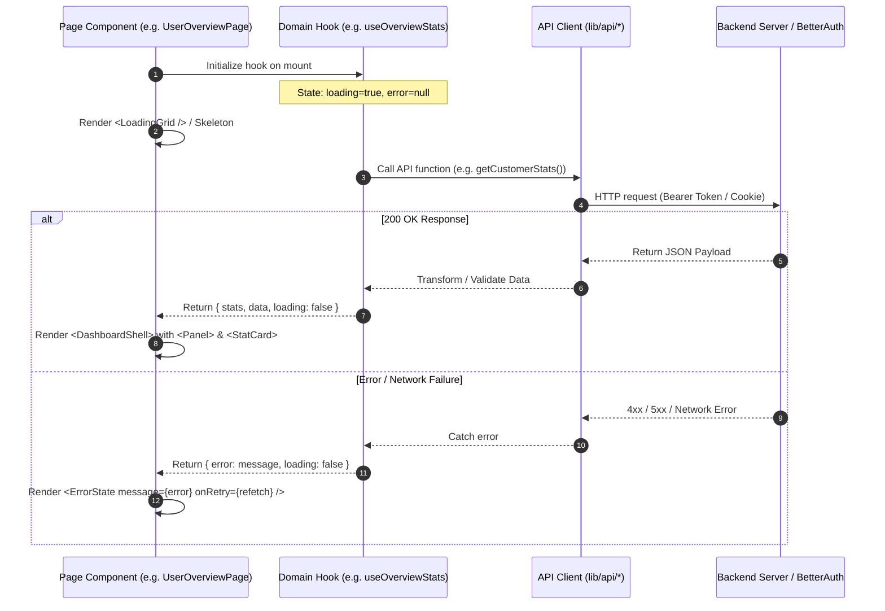

# ShopNest Dashboard Architecture & Technical Report

## 1. Executive Summary

The ShopNest dashboard is a multi-tenant, role-based single-page application subsystem built on top of **Next.js (App Router)** and **TypeScript**. Rather than treating the dashboard as a single monolithic interface, the system is architected as **three specialized portals** (Customer, Seller, Admin) managed under a unified routing, layout, and visual design system.

---

## 2. End-to-End Architecture & Lifecycle



---

## 3. Structural Layers & File Roles

### Layer 1: Routing & Gatekeeper
* **[`src/app/dashboard/page.tsx`](file:///c:/Users/User/Projects/E-commerce/ShopNest/frontend_b/src/app/dashboard/page.tsx)**:
  - Has zero UI of its own.
  - Acts as a traffic controller on mount.
  - Reads `session.user.role` from `useSession()` and redirects to `/dashboard/user`, `/dashboard/seller`, or `/dashboard/admin`.
* **[`src/hooks/dashboard/useDashboardGuard.ts`](file:///c:/Users/User/Projects/E-commerce/ShopNest/frontend_b/src/hooks/dashboard/useDashboardGuard.ts)**:
  - Role-level authorization guard used by role layouts to prevent unauthorized access (e.g. standard customers accessing `/dashboard/admin`).

---

### Layer 2: Frame & Navigation Shell
* **[`src/app/dashboard/layout.tsx`](file:///c:/Users/User/Projects/E-commerce/ShopNest/frontend_b/src/app/dashboard/layout.tsx)**:
  - Top-level Next.js layout wrapping every child route under `/dashboard/**`.
  - Mounts `DashboardSidebarLayout`.
* **[`src/components/dashboard/DashboardLayout.tsx`](file:///c:/Users/User/Projects/E-commerce/ShopNest/frontend_b/src/components/dashboard/DashboardLayout.tsx)**:
  - Manages the desktop sidebar (collapsible), mobile responsive drawer, top search/action header, role indicators, and profile/logout actions.
* **[`src/lib/constants/dashboard-nav.ts`](file:///c:/Users/User/Projects/E-commerce/ShopNest/frontend_b/src/lib/constants/dashboard-nav.ts)**:
  - **Single Source of Truth** for navigation links. Defines `userDashboardLinks`, `sellerDashboardLinks`, and `adminDashboardLinks`.
  - Adding a new dashboard route requires adding just one entry here to keep all sidebars in sync.

---

### Layer 3: Presentation & State Primitives
Located in `src/components/dashboard/`:

```
src/components/dashboard/
├── DashboardLayout.tsx     --> Frame: Sidebar, drawer, role header
├── DashboardUI.tsx         --> Primitives: Shell, Header, Panel, StatCard, Grid
└── DashboardStates.tsx     --> Feedback: LoadingCard, LoadingTable, EmptyState, ErrorState
```

#### Detailed Breakdown of Primitives

| Component | File | Purpose |
| :--- | :--- | :--- |
| `DashboardShell` | [`DashboardUI.tsx`](file:///c:/Users/User/Projects/E-commerce/ShopNest/frontend_b/src/components/dashboard/DashboardUI.tsx) | Outermost page container, automatically renders header and subtitle. |
| `DashboardHeader` | [`DashboardUI.tsx`](file:///c:/Users/User/Projects/E-commerce/ShopNest/frontend_b/src/components/dashboard/DashboardUI.tsx) | Page title, breadcrumb/role tag, and optional quick-action buttons. |
| `Panel` | [`DashboardUI.tsx`](file:///c:/Users/User/Projects/E-commerce/ShopNest/frontend_b/src/components/dashboard/DashboardUI.tsx) | Clean white/dark card container with optional header, icon, and actions. |
| `StatCard` | [`DashboardUI.tsx`](file:///c:/Users/User/Projects/E-commerce/ShopNest/frontend_b/src/components/dashboard/DashboardUI.tsx) | KPI summary widget displaying icons, trends, and metric values. |
| `LoadingCard` / `LoadingGrid` | [`DashboardStates.tsx`](file:///c:/Users/User/Projects/E-commerce/ShopNest/frontend_b/src/components/dashboard/DashboardStates.tsx) | Animated skeleton placeholders during async fetching. |
| `EmptyState` / `ErrorState` | [`DashboardStates.tsx`](file:///c:/Users/User/Projects/E-commerce/ShopNest/frontend_b/src/components/dashboard/DashboardStates.tsx) | User-friendly empty or failure feedback with retry/action triggers. |

---

## 4. Sub-Domain Portals Breakdown

```
src/app/dashboard/
│
├── user/                       --> Shopper Hub (13 Pages)
│   ├── page.tsx                --> Commerce Command Center & Shopping Intent Engine
│   ├── analytics/              --> Spending charts & category analytics
│   ├── journey/                --> Chronological shopping journey timeline
│   ├── budget/                 --> Cart budget optimizer & combination suggestions
│   ├── goals/                  --> Milestone saving & target trackers
│   ├── lifecycle/              --> Warranty, repairs & maintenance lifecycle
│   └── security/               --> Active sessions, login history & security score
│
├── seller/                     --> Merchant Portal (18 Pages)
│   ├── page.tsx / command-center --> Real-time revenue & sales KPI dashboard
│   ├── analytics/              --> Conversion funnels & cohort analytics
│   ├── product-performance/    --> SKU performance & velocity metrics
│   ├── forecast/               --> AI demand & revenue forecasting
│   ├── inventory/              --> Stock health & automatic restock triggers
│   ├── trust-score/            --> Reputation, fulfillment & dispute health
│   ├── risk-indicators/        --> Transaction anomaly & dispute risk scoring
│   ├── ai-tools/               --> AI listing generator & automated pricing
│   └── store-settings/         --> Merchant profiles & shipping rules
│
└── admin/                      --> Platform Operator Portal (14 Pages)
    ├── page.tsx                --> Marketplace health (GMV, active buyers/sellers)
    ├── analytics/              --> Macro platform financial & volume metrics
    ├── security/               --> Platform-wide posture & active threats
    ├── risk/                   --> Fraud rings, velocity spikes & chargebacks
    ├── incidents/              --> Incident tracking & mitigation status
    ├── audit-logs/             --> Immutable administrative audit trail
    └── sellers/ / users/       --> Entity moderation & verification
```

---

## 5. Data Flow & State Lifecycle



### Dedicated API Services (`src/lib/api/`)
- **Customer**: [`customer-features.ts`](file:///c:/Users/User/Projects/E-commerce/ShopNest/frontend_b/src/lib/api/customer-features.ts), [`customer-intelligence.ts`](file:///c:/Users/User/Projects/E-commerce/ShopNest/frontend_b/src/lib/api/customer-intelligence.ts)
- **Seller**: [`seller-intelligence.ts`](file:///c:/Users/User/Projects/E-commerce/ShopNest/frontend_b/src/lib/api/seller-intelligence.ts)
- **Admin**: [`admin-intelligence.ts`](file:///c:/Users/User/Projects/E-commerce/ShopNest/frontend_b/src/lib/api/admin-intelligence.ts), [`admin-copilot.ts`](file:///c:/Users/User/Projects/E-commerce/ShopNest/frontend_b/src/lib/api/admin-copilot.ts)
- **Security & Governance**: [`security-center.ts`](file:///c:/Users/User/Projects/E-commerce/ShopNest/frontend_b/src/lib/api/security-center.ts)

---

## 6. Key Architectural Takeaways

1. **Strict Separation of Concerns**:
   - `app/dashboard/**` contains **routing and composition** only.
   - `components/dashboard/**` contains **reusable UI presentation**.
   - `hooks/dashboard/**` contains **business logic and state fetching**.
   - `lib/api/**` contains **pure HTTP client calls**.

2. **Zero Route Duplication**:
   - The navigation structure is driven declaratively by [`dashboard-nav.ts`](file:///c:/Users/User/Projects/E-commerce/ShopNest/frontend_b/src/lib/constants/dashboard-nav.ts).

3. **Resilient UX**:
   - Every async dashboard page consistently provides three UI states: **Loading** (`DashboardStates`), **Empty** (`EmptyState`), and **Data Populated** (`DashboardShell` + `Panel`).
